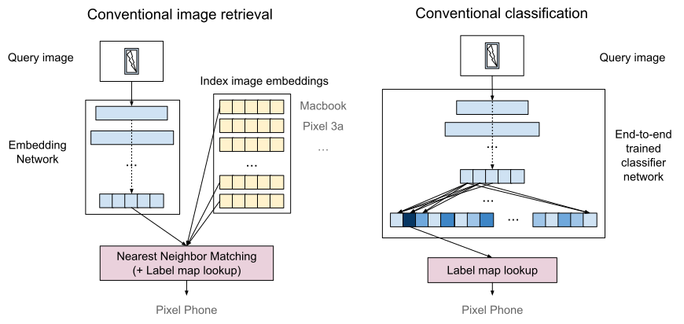
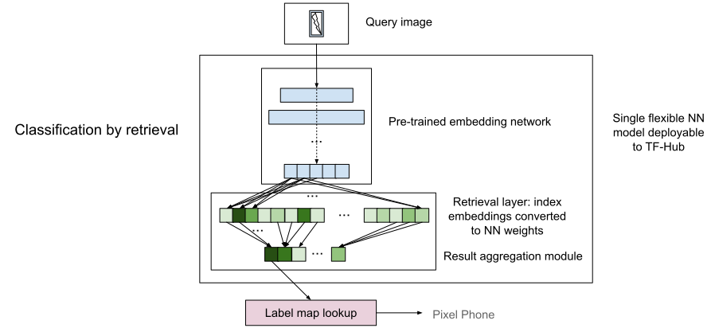

# CbR: Classification-by-Retrieval

Classification-by-retrieval provides an easy way to create a neural network
classifier without computationally expensive training (backpropagation).
For example, one may use our [iOS app](ios/README.md) to just choose images
from the photo library and label them to create a TfLite classifier within
seconds (if the number of images are small) and test them right away.
Or, one may use our C++ command line tool (in lib/tests) to build a classifier.
Using this technology, one can create a mobile model from as little as
[a few images](#model-accuracy-comparison-with-few-shot-learning) to as many as
a hundred of thousands of images
([examples](https://tfhub.dev/google/collections/landmarks/1)).

Example use cases:

*  Machine learning education (e.g., an educational hackathon event).
*  Prototyping or demonstrating an application of ML classification.
*  Custom product recognition (e.g., developing a product recognition app for a
   small/medium business).

## Technical background

Classification and retrieval are two distinct methods of object recognition.
A typical object recognition approach is to build a neural network classifier
and train it with a large number of training data.
On the contrary, the retrieval approach uses a pre-trained feature extractor
(e.g., image embeddings) with feature matching based on a nearest neighbor
search algorithm.
The retrieval approach is scalable and flexible.
For example, it can handle a large number of classes (say, > 1 million), and
adding or removing classes does not require extra training.
One would need as small as a single training data per class, which makes it
effectively few-shot learning.
A downside of the retrieval approach is that it requires extra infrastructure,
and is less intuitive to use.
Classification-by-retrieval (CbR) is a single neural network model with image
retrieval layers baked into it.
With the CbR technology, one can easily create a TensorFlow classification model
without any training.

## How do the retrieval layers work?

A classification-by-retrieval model is an extension of an embedding model with
extra retrieval layers.
The retrieval layers are computed (not trained) from the training data, i.e.,
the index data.
The retrieval layers consists of two components:

*  Nearest neighbor matching component
*  Result aggregation component

The nearest neighbor matching component is essentially a fully connected layer
where its weights are the normalized embeddings of the index data.
Note that a dot-product of two normalized vectors (cos similarity) is linear
(with a negative coefficient) to the squared L2 distance.
Therefore, the output of the fully connected layer is effectively identical to
the nearest neighbor matching result.

The retrieval result is given for each training instance, not for each class.
Therefore, we add another *result aggregation component* on top of the nearest
neighbor matching layer.
The aggregation component consists of a selection layer for each class followed
by an aggregation (e.g., max) layer for each of them.
Finally, the results are concatenated to form a single output vector.

## Base Embedding Model

One may choose a base embedding model that best fits the domain.
There are many embedding models available, for example, in
[TensorFlow hub](http://tfhub.dev), for various domains.
The provided [iOS demo](ios/README.md) uses a
[MobileNet V3 trained with ImageNet](https://tfhub.dev/google/lite-model/imagenet/mobilenet_v3_small_100_224/feature_vector/5/default/1).

## Model Accuracy: Comparison with Few Shot Learning

One strength of the CbR is that it provides a train-less few-shot learning.
Although it is not apples to apples to compare CbR with an arbitrary pre-trained
base embedding model with a typical few-shot learning approach where the whole
model trained with given training data, there is a
[research by Wang et al.](https://arxiv.org/pdf/1911.04623.pdf) that compares
nearest neighbor retrieval (which is equivalent to CbR) with few-shot learning
approaches. It shows that nearest neighbor retrieval can be comparable or even
better than many few-shot learning approaches.

## Responsible Model Building

We encourage you to build a model that is fair and responsible. To learn more
about building a responsible model:

*   https://design.google/library/fair-not-default/
*   https://developers.google.com/machine-learning/crash-course/fairness/video-lecture
