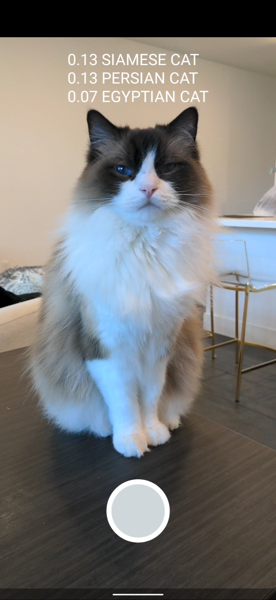

# TensorFlow Lite in Play Services image classification Android example application

## TensorFlow Lite(TFLite)

This example implements an Activity that performs real-time image classification
on the live camera frames. It performs the following operations:

1.  Initializes camera preview and image analysis frame streams using CameraX
2.  Loads a EfficientNet-Lite model using Tensorflow Lite in Play Services
3.  Performs inference on the transformed frames
4.  Reports the image recognized on the screen

### Model

This app uses EfficientNet-Lite model for demonstration. For details of the
model used, visit
[Image classification](https://www.tensorflow.org/lite/models/image_classification/overview).

Downloading, extracting, and placing the model in the assets folder is managed
automatically by download.gradle.

## Requirements

*   Android Studio (installed on a Linux, Mac or Windows machine)
*   Android device in
    [developer mode](https://developer.android.com/studio/debug/dev-options)
    with USB debugging enabled
*   USB cable (to connect Android device to your computer)

## Build and run

### Step 1. Clone the TensorFlow examples source code

Clone the TensorFlow examples GitHub repository to your computer to get the demo
application.

```
git clone https://github.com/tensorflow/examples
```

Open the example application's project directory in Android Studio. To do this,
open Android Studio and select `Open an existing project`, setting the folder to
`examples/lite/examples/image_classification/android_play_services`

### Step 2. Build the Android Studio project

Select `Build -> Make Project` and check that the project builds successfully.
You will need Android SDK configured in the settings. You'll need at least SDK
version 23. The `build.gradle` file will prompt you to download any missing
libraries. The `download.gradle` file directs gradle to download the model used
in the example, placing it into `assets`.

#### Optional: Switch between source code language (Kotlin and Java)

This sample app demonstrates two implementation options:

*   [Default] Kotlin: Under `app/src/kotlin`
*   Java: Under `app/src/java`

The [`build.gradle`](app/build.gradle) inside the `app` folder shows how to
change `flavorDimensions "language"` to switch between the two options.

Inside **Android Studio**, you can change the build variant to whichever one you
want to build and run — just go to `Build > Select Build Variant` and select one
from the drop-down menu. See
[configure product flavors in Android Studio](https://developer.android.com/studio/build/build-variants#product-flavors)
for more details.

### Step 3. Install and run the app

Connect the Android device to the computer and be sure to approve any ADB
permission prompts that appear on your phone. Select `Run -> Run app.` Select
the deployment target in the connected devices to the device on which the app
will be installed. This will install the app on the device.

To test the app, open the app called `Image Classification` on your device. When
you run the app the first time, the app will request permission to access the
camera. Re-installing the app may require you to uninstall the previous
installations.

## Screenshots




## Source Code Structure

*   `app/src/kotlin`: Sample app implemented in Kotlin language.
*   `app/src/java`: Sample app implemented in Java language.
*   `app/src/main`: Resources and Assets.
*   `app/src/androidTest`: Instrumentation test code that are shared between
    build variants.
*   `app/src/androidTestKotlin`: Instrumentation test code that only applies to
    Kotlin implementation.
*   `app/src/androidTestJava`: Instrumentation test code that only applies to
    Java implementation.

> Note: Gradle expects the directory structure to match the following:
> `$module`/src/`$build_variant`/(`$language`|res|assets|AndroidManifest.xml|...)
> For this app:
>
> *   `$module` == app
> *   `$build_variant` == kotlin
> *   `$language` == kotlin

### Assets folder

*Do not delete the assets folder content*. If you explicitly deleted the files,
choose `Build -> Rebuild` to re-download the deleted model files into the assets
folder.
