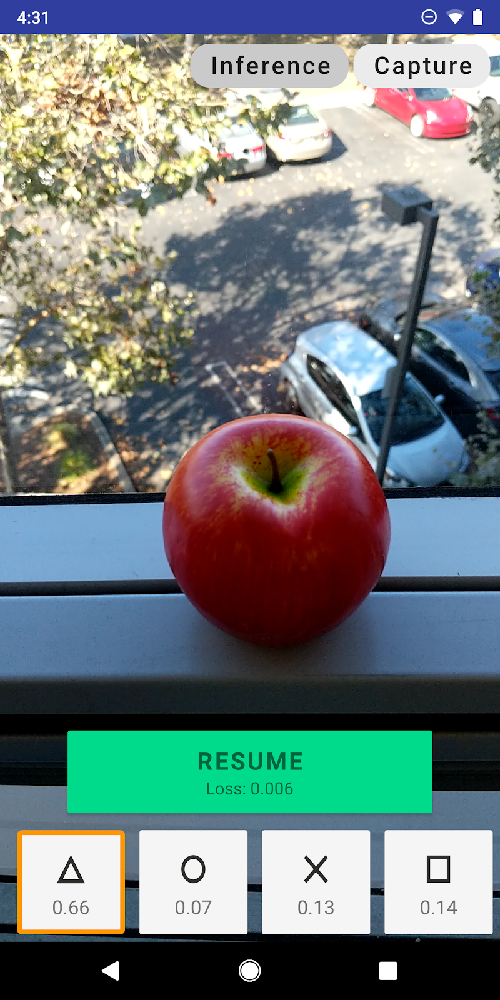

# TensorFlow Lite Example On-device Model Personalization

This example illustrates a way of personalizing a TFLite model
on-device without sending any data to the server. It builds
on top of existing TFLite functionality, and can be adapted
for various tasks and models.

## Quickstart

Pre-requisites:

- [Android Studio](https://developer.android.com/studio).
- [Python 3.7+](https://www.python.org/downloads/).
- [`virtualenv`](https://packaging.python.org/guides/installing-using-pip-and-virtual-environments/#installing-virtualenv)
  (usually comes preinstalled with Python).
- Physical Android device with camera.

### Prepare the TfLite model

For the following workflow, a Python virtual environment setup is optional but
recommended. We assume Python 3.5+ by default.

```shell
pushd transfer_learning

# Create a virtualenv.
python3 -m venv env
# Activate the created virtualenv.
source env/bin/activate

# Install the package requirements.
pip install -r requirements.txt

# Generate the model flatbuffer file `model.tflite` in the current directory.
python generate_training_model.py
popd

# Copy over the flatbuffer file to the `android` assets directory.
cp transfer_learning/model.tflite android/app/src/main/assets/model/model.tflite
```

### Install and run the application

You can either build and run the application inside Android Studio
or run command line to do so.

If you want to use Android Studio, first import the
project into Android Studio (point it to the top-level `build.gradle`
file), connect your Android device to your machine, and use the
`Run` button in Android Studio. If the `Run` button is inactive,
first add an Android application build configuration for the `app`
module.

If you want to build and install on Linux directly, you can first
switch to the `android` folder, then execute

```shell
gradle wrapper
./gradlew build
```

Then you can run the following command to install the apk

```shell
adb install ./app/build/outputs/apk/debug/app-debug.apk
```

If you need to install gradle, you can reference this [link](https://docs.gradle.org/current/userguide/installation.html)

The running application will look like

<p align="center">
  
</p>

You should now have the app started on your device. Please refer to the `Help`
menu for more detailed instruction.

The buttons at the bottom of the screen correspond to classes that the app
learns to distinguish between. Initially, the confidence scores
(numbers on the buttons) for all classes will be either random
or constant depending on the model.

To start training the classifier, you need at least one image captured.
To take a photo and associate it with a class, press the corresponding
class button. For better results and accuracy, please take at least 10
images per class, ideally with different background and/or object orientation.

After collecting at least 1 sample photos, the "Train" button should
become active. Press it, and wait for a few seconds until the loss
goes down. Then press "Pause", and switch to the inference
mode in the top-right corner.  The classifier should now attempt
to predict the class of the camera input class in real time.

## Structure

There are three main parts of this project:

- Model Generation: a Python CLI that allows you to
  define and generate your personalizable model. The code
  lives under `transfer_learning` directory.

- Android library: a library that allows you to use models
  generated by the convert from an Android app. The code
  lives under `android/transfer_api` directory in a separate
  Gradle module.

- Android classifier app: an application that illustrates
  how to use the model personalization library. The code lives
  under `android/app`.

### Customizing the model

First, you need to pick the models that you want to use with model
personalization. A TFLite on-device personalization model has two parts:
the base model, which is typically trained for a generic data-rich task,
and the head model, which will be trained on device. Base model weights
are fixed during conversion, and cannot be changed later. You need
to pick two models for both parts respectively.

As an example of TensorFlow models, we provide one example in the
`transfer_learning/generate_training_model.py` file, with the following
components:

- Base Model: `tf.keras.applications.MobileNetV2`, a pre-trained
  MobileNetV2 model, which is a good fit for image recognition tasks.

- Head Model: a single dense layer followed by softmax activation.

- Optimizer: `tf.keras.optimizers.Adam` with the default setting
  `learning_rate=0.001`.

Feel free to create/modify the Transfer Learning model structure and
configurations.
