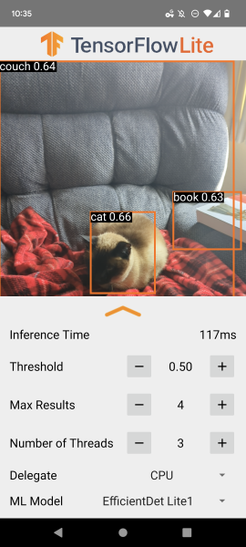

# TensorFlow Lite Object Detection Android Demo

### Overview

This is a camera app that continuously detects the objects (bounding boxes and
classes) in the frames seen by your device's back camera, with the option to use
a quantized
[MobileNet SSD](https://tfhub.dev/tensorflow/lite-model/ssd_mobilenet_v1/1/metadata/2),
[EfficientDet Lite 0](https://tfhub.dev/tensorflow/lite-model/efficientdet/lite0/detection/metadata/1),
[EfficientDet Lite1](https://tfhub.dev/tensorflow/lite-model/efficientdet/lite1/detection/metadata/1),
or
[EfficientDet Lite2](https://tfhub.dev/tensorflow/lite-model/efficientdet/lite2/detection/metadata/1)
model trained on the [COCO dataset](http://cocodataset.org/). These instructions
walk you through building and running the demo on an Android device.

The model files are downloaded via Gradle scripts when you build and run the
app. You don't need to do any steps to download TFLite models into the project
explicitly.

**Terms:** By accessing or using TensorFlow Lite in Google Play services,
you agree to the [Terms of Service](https://www.tensorflow.org/lite/android/play_services#tos).
Please read and understand all applicable terms and policies before accessing
the APIs.

This application should be run on a physical Android device.

## Build the demo using Android Studio

### Prerequisites

*   The **[Android Studio](https://developer.android.com/studio/index.html)**
    IDE. This sample has been tested on Android Studio Bumblebee.

*   A physical Android device with a minimum OS version of SDK 24 (Android 7.0 -
    Nougat) with developer mode enabled. The process of enabling developer mode
    may vary by device. This device will also need to have the latest version of
    Google Play Services installed.

### Building

*   Open Android Studio. From the Welcome screen, select Open an existing
    Android Studio project.

*   From the Open File or Project window that appears, navigate to and select
    the tensorflow-lite/examples/object_detection/android directory. Click OK.

*   If it asks you to do a Gradle Sync, click OK.

*   With your Android device connected to your computer and developer mode
    enabled, click on the green Run arrow in Android Studio.

### Models used

Downloading, extraction, and placing the models into the assets folder is
managed automatically by the download.gradle file.