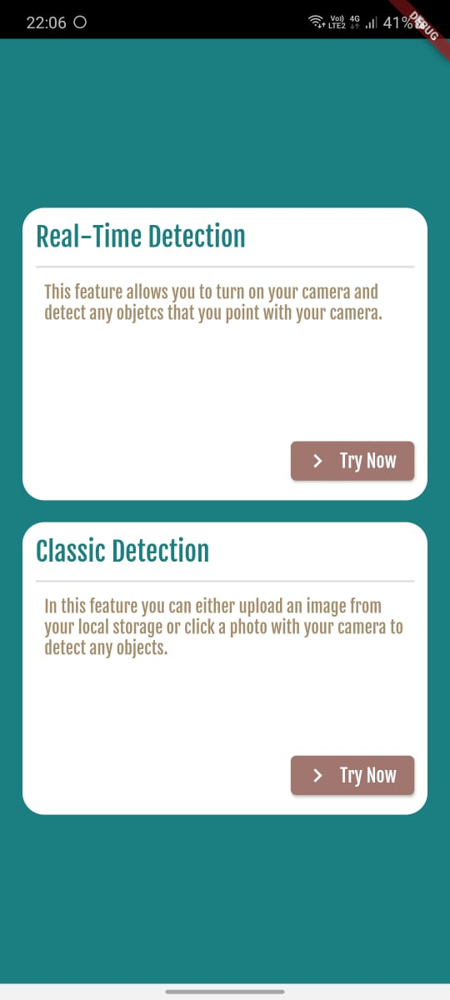
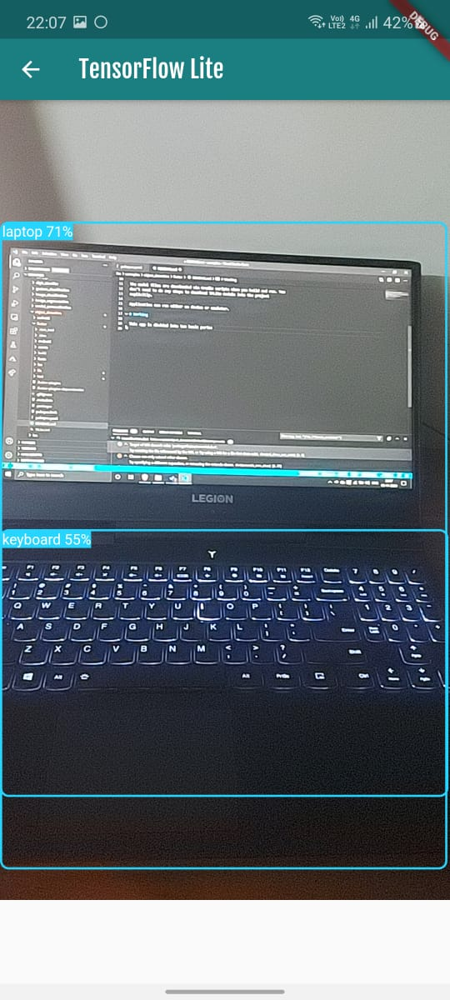
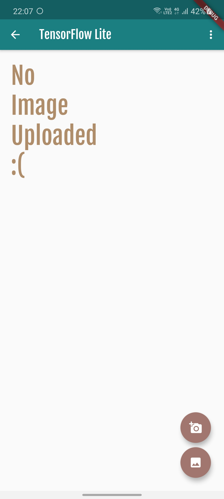
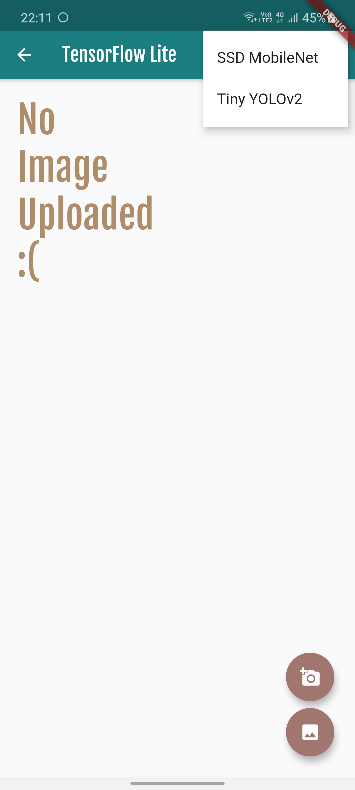
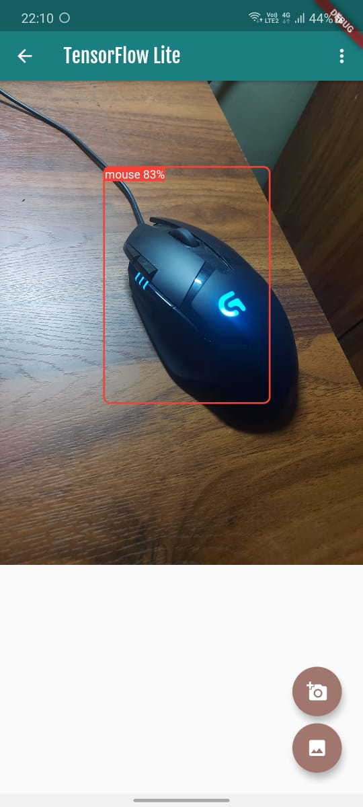
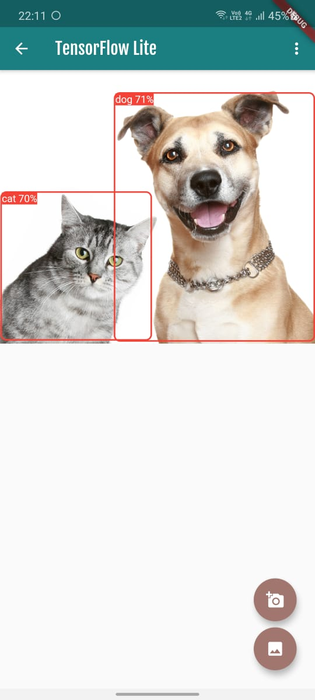

# TensorFlow Lite Object Detection using Flutter(Android)

### Overview

This is a camera app that can detect objects either real-time (by turning on the 
camera of our mobile device), click a photo with the rear camera or load an image from our gallery. It draws a box around the detected object with the name of the detected object and it's confidence level.

The Real-time detection works on the [MobileNet SSD](https://github.com/tensorflow/models/tree/master/research/object_detection) model while the Classic detection works on both the [MobileNet SSD](https://github.com/tensorflow/models/tree/master/research/object_detection)
model and the [YoloV2](https://colab.research.google.com/github/sony/nnabla-examples/blob/master/interactive-demos/yolov2.ipynb) model. Either model can be selected as desired.

The model files are downloaded via Gradle scripts when you build and run. You
don't need to do any steps to download TFLite models into the project
explicitly.

Application can run either on device or emulator. 

# Working

This app is divided into two basic parts: 
1. Real-time Detection
2. Classic Detection

## Real-time Detection

In this mode the rear camera of our mobile device is turned on and objects are detected on each frame of the video.

## Classic Detection

In this mode you can either choose to click a photo or load an image from the gallery by tapping on either of the floating action buttons on the bottom right of the screen. On the AppBar you can choose which model you want to run.

> Screen look

> Choose a model

> Clicking a photo

> Loading from gallery
