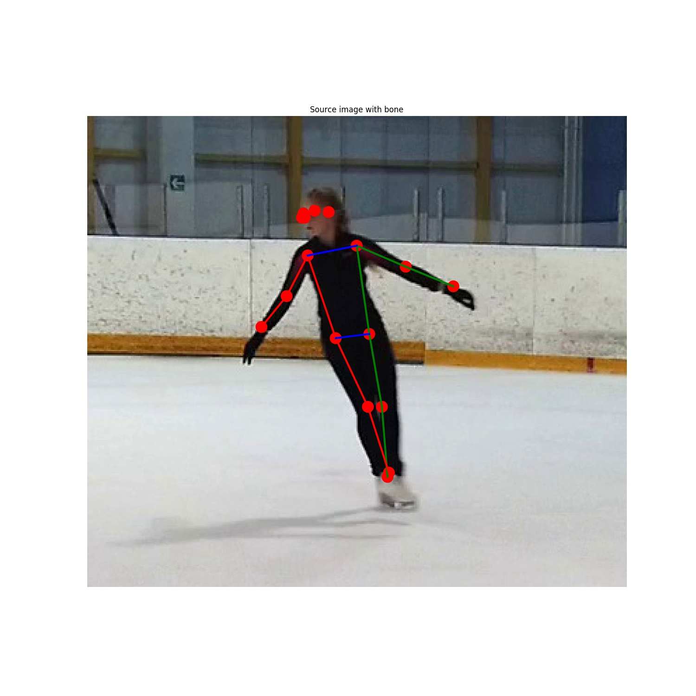

# Posenet demo example

## ENV
Configuration:
  * python 3.7.3
  * tensorflow 2.0
  * numpy 1.17
  
more info look in **requirements.txt**

## RUN
1. ``cd examples/lite/examples/posenet/python``
2. **Download posenet** from page https://www.tensorflow.org/lite/models/pose_estimation/overview 
in path ``model/``. Check model path in ``pose.py``: 
``posenet = posenet.Posenet("model/posenet_mobilenet_v1_100_257x257_multi_kpt_stripped.tflite")``
3.  ``python pose.py``. 

## WORK RESULTS
After run program print in console message with body part and 
its point:

    Processing file: images/source/00001.jpg
    {'nose': (129, 89), 'leftEye': (132, 82), 'rightEye': (130, 82), 'leftEar': (144, 85), 'rightEar': (146, 84), 'leftShoulder': (152, 116), 'rightShoulder': (158, 114), 'leftElbow': (157, 164), 'rightElbow': (157, 156), 'leftWrist': (123, 192), 'rightWrist': (125, 186), 'leftHip': (188, 180), 'rightHip': (196, 175), 'leftKnee': (182, 239), 'rightKnee': (186, 240), 'leftAnkle': (168, 296), 'rightAnkle': (228, 296)}

In path ``image/output`` you can look file same it: 
Source file in path ``images/source``

## Troubles
1. Sometimes net change right and left point - see ``0020.jpg``
2. If object is invisible, net place find it anytime - see ``0020.jpg``

## License
Apache License 2.0

## Author
Prostakov Aleksey, email: aleksey.prostakov@gmail.com
