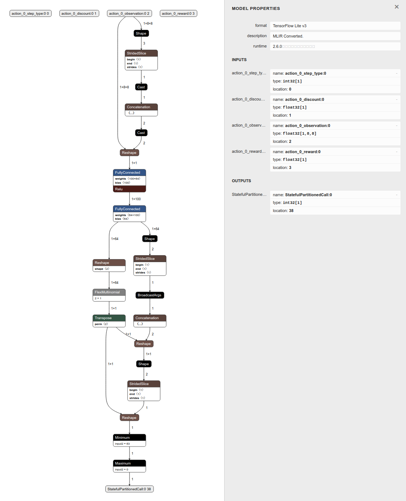
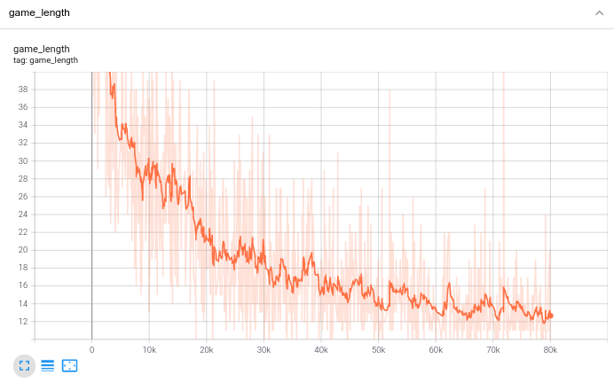

# Training code for Plane Strike.

This folder contains the training code for the board game Plane Strike. This
reference app is a simple board game (called 'Plane Strike') in which you play
against an agent trained by reinforcement learning. The agent runs the
reinforcement learning model on-device using TensorFlow Lite.

The game rule for Plane Strike is very simple. It is a turn-based board game and
is very similar to the
[Battleship game](https://en.wikipedia.org/wiki/Battleship_\(game\)) game. The
only difference is that Battleship allows you to place battleships (2–5 cells in
a row or a column as 'battleships'); you can place multple ships. Plane Strike
instead allows you to place a ‘plane’ on the board at the beginning of the game.
In the animation we can see 2 boards (the top one is the agent's board and the
bottom one is yours), each of which has a plane on the board. Of course you have
no visibility on the agent’s plane location when the game starts. In a live
game, the agent’s plane is hidden at the beginning; you need to guess out all
the plane cells before the agent does to your plane cells. Whoever finds out all
of the opponent's plane cells first wins. Then the game restarts.

At the beginning of the game, the app will randomly place the planes for the
agent and the player. You can see the plane as 8 blue cells in your board. If
you are not happy with the placement, just reset the game so that the plane
placements will be changed.

During the gameplay, if you, as the player, tap a cell in the agent's board at
the top, and that cell turns out to be a 'plane cell', it will turn red (think
of this action as a hit); if it's not a 'plane cell', the cell will turn yellow
as a miss. The app also tracks the number of hits of both boards so that you can
get a quick idea of the game progress. You can tap the same cell multiple times,
but it won't do anything other than wasting your strike opportunities.

To train the agent, we have implemented different ways:

*   [TF Agents](https://www.tensorflow.org/agents) (along with a python
    envronment for TF Agents)
*   TensorFlow and
    [JAX](https://github.com/google/jax)/[Flax](https://github.com/google/flax)
    (along with an [OpenAI gym environment](https://gym.openai.com/))

*Note that the JAX implementation is highly experimental

You can choose one of the 3 training paths to train the model by yourself. It's
possible to make training faster or more effective by taking advantage
of the board symmetry, better reward shaping, parallel runs and etc.

## Requirements

Please install the required libraries in requirements.txt first.

```
pip install -r requirements.txt
```

As of 7/2021, only the nightly version of TF/TF Agents can support converting a
policy into TFLite model.

## Build and run

### TF Agents:

Go into the `tf_agents` folder and run the following:

```
python training_tf_agents.py
tensorboard --logdir=./tf_agents_log
```

You can also use TensorBoard to visualize the training process by looking at the
average reward and the average episode length.

You can see the agent become smarter (indicated by the increasing average reward
and decreasing episode length), as training progresses.

After training, you will get a `planestrike_tf_agents.tflite` file, which you
can then integrate into the Android app we provide in the `android` folder. Note
that the TFLite model converted from the TF Agents policy is a little from
TF/JAX model in that it takes 4 tensors as input (only the 3rd tensor
'observation' is useful for inferene though):



### TensorFlow or JAX:

#### Step 1. Install the OpenAI gym environment

Go into the `tf_and_jax/gym_planestrike` folder and run the following to install
the gym environment:

```
python setup.py install
```

#### Step 2. Train the model

Choose either training_tf.py or training_jax.py in the `tf_and_jax` folder to
train the model. You can also use TensorBoard to visualize the training process
by looking at the game_length (a smoothing factor of 0.9 is recommended):

```
python training_tf.py
tensorboard --logdir=./tf_log
```

Or:

```
python training_jax.py
tensorboard --logdir=./jax_log
```

You can see the agent become smarter (indicated by the decreasing game length),
as training progresses.



After training, you will get a `planestrike_tf.tflite` file, which you can then
integrate into the Android app we provide in the `android` folder.

## References

*   [OpenAI Spinning Up](https://spinningup.openai.com/en/latest/algorithms/vpg.html)
*   [Deep reinforcement learning, battleship](https://www.efavdb.com/battleship)
