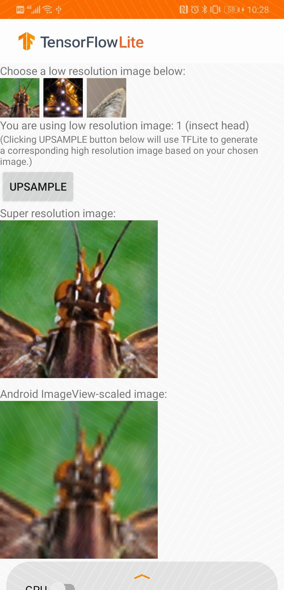

# Super Resolution Android sample.

The task of recovering a high resolution (HR) image from its low resolution
counterpart is commonly referred to as Single Image Super Resolution (SISR).

The model used here is ESRGAN
([ESRGAN: Enhanced Super-Resolution Generative Adversarial Networks](https://arxiv.org/abs/1809.00219)).
The TFLite model is converted from this
[implementation](https://tfhub.dev/captain-pool/esrgan-tf2/1) hosted on TF Hub.
Demo images are from [DIV2K dataset](https://data.vision.ee.ethz.ch/cvl/DIV2K/).

This sample automatically downloads TFLite JAR files and uses TFLite C API
through Android NDK.



## Requirements

*   Android Studio 4.2 or above (installed on a Linux, Mac or Windows machine)
*   An Android device, or an Android Emulator

## Build and run

### Step 1. Clone the TensorFlow examples source code

Clone the TensorFlow examples GitHub repository to your computer to get the demo
application.

```
git clone https://github.com/tensorflow/examples
```

### Step 2. Import the sample app to Android Studio

Open the TensorFlow source code in Android Studio. To do this, open Android
Studio and select `Import Projects (Gradle, Eclipse ADT, etc.)`, setting the
folder to `examples/lite/examples/super_resolution/android`

### Step 3. Download TFLite library

Open your terminal and go to the sample folder. Type './gradlew fetchTFLiteLibs'
to run the download tasks. Use 'gradlew.bat' on Windows.

### Step 4. Run the Android app

Connect the Android device to the computer and be sure to approve any ADB
permission prompts that appear on your phone. Select `Run -> Run app.` Select
the deployment target in the connected devices to the device on which the app
will be installed. This will install the app on the device.

To test the app, open the app called `TFL Super Resolution` on your device.
Re-installing the app may require you to uninstall the previous installations.

## Future work:

*   Use a distilled version to do video super resolution

## Resources used:

*   [TensorFlow Lite](https://www.tensorflow.org/lite)
*   [ESRGAN: Enhanced Super-Resolution Generative Adversarial Networks](https://arxiv.org/abs/1809.00219)
