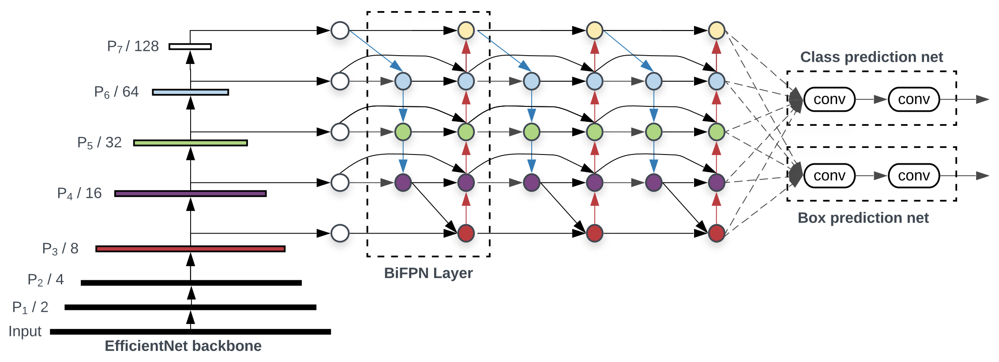
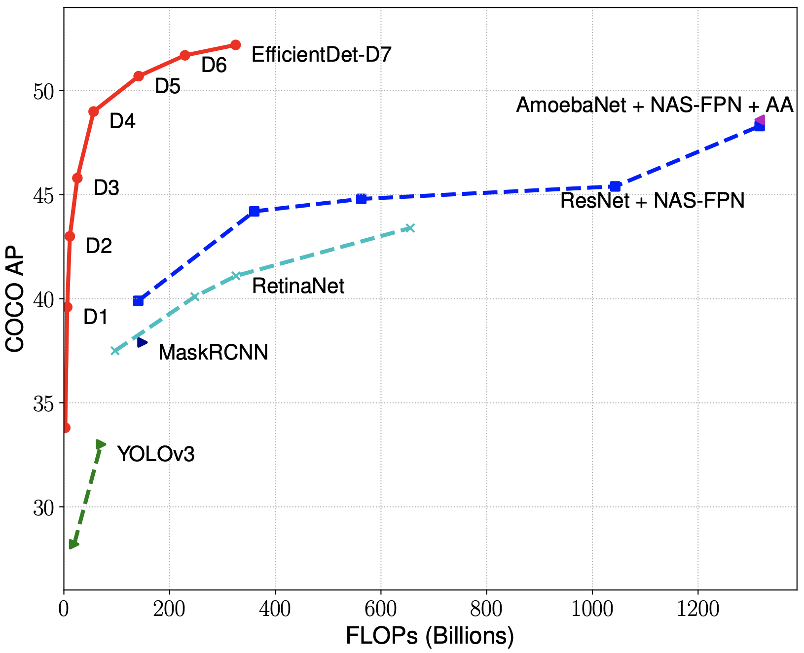
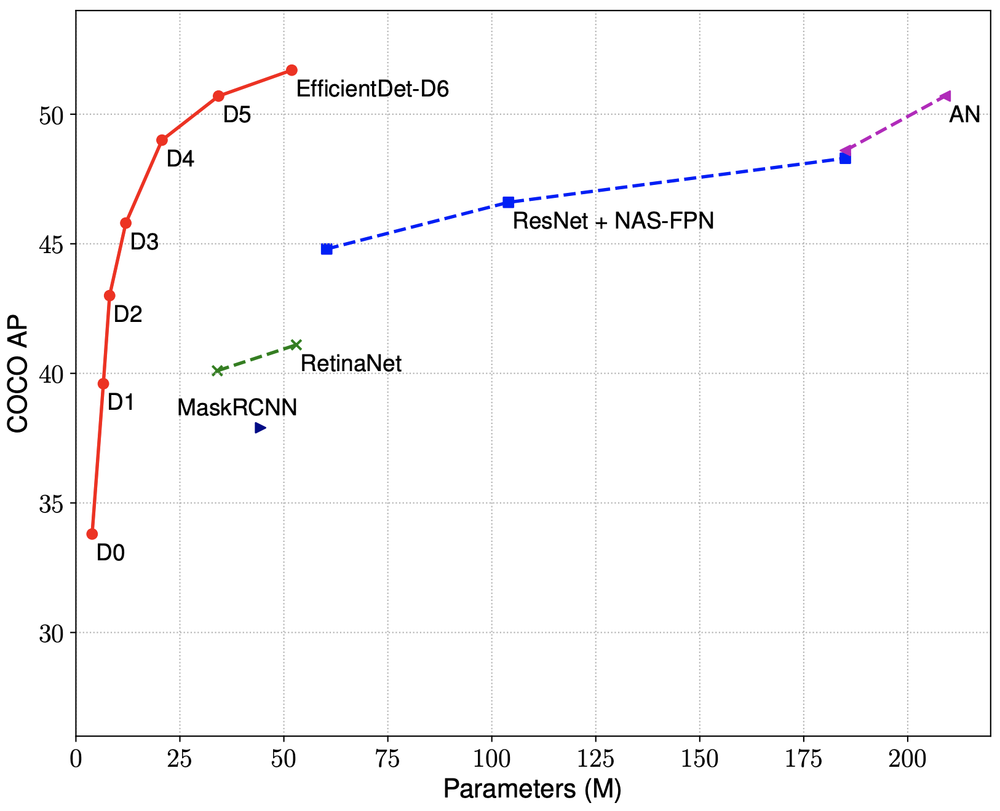

# EfficientDet

[1] Mingxing Tan, Ruoming Pang, Quoc V. Le. EfficientDet: Scalable and Efficient Object Detection. CVPR 2020.
Arxiv link: https://arxiv.org/abs/1911.09070

**Quick start tutorial: [tutorial.ipynb](tutorial.ipynb)**

**Quick install dependencies: ```pip install -r requirements.txt```**

## 1. About EfficientDet Models

EfficientDets are a family of object detection models, which achieve state-of-the-art 55.1mAP on COCO test-dev, yet being 4x - 9x smaller and using 13x - 42x fewer FLOPs than previous detectors. Our models also run 2x - 4x faster on GPU, and 5x - 11x faster on CPU than other detectors.


EfficientDets are developed based on the advanced backbone, a new BiFPN, and a new scaling technique:

<p align="center">

</p>

  * **Backbone**: we employ [EfficientNets](https://arxiv.org/abs/1905.11946) as our backbone networks.
  * **BiFPN**: we propose BiFPN, a bi-directional feature network enhanced with fast normalization, which enables easy and fast feature fusion.
  * **Scaling**: we use a single compound scaling factor to govern the depth, width, and resolution for all backbone, feature & prediction networks.

Our model family starts from EfficientDet-D0, which has comparable accuracy as [YOLOv3](https://arxiv.org/abs/1804.02767). Then we scale up this baseline model using our compound scaling method to obtain a list of detection models EfficientDet-D1 to D6, with different trade-offs between accuracy and model complexity.


<table border="0">
<tr>
    <td>
    
    </td>
    <td>
    
    </td>
</tr>
</table>

** For simplicity, we compare the whole detectors here. For more comparison on FPN/NAS-FPN/BiFPN, please see Table 4 of our [paper](https://arxiv.org/abs/1911.09070).


## 2. Pretrained EfficientDet Checkpoints

We have provided a list of EfficientDet checkpoints and results as follows:

|       Model    | AP<sup>test</sup>    |  AP<sub>50</sub> | AP<sub>75</sub> |AP<sub>S</sub>   |  AP<sub>M</sub>    |  AP<sub>L</sub>   |  AP<sup>val</sup> | | #params | #FLOPs |
|----------     |------ |------ |------ | -------- | ------| ------| ------ |------ |------ |  :------: |
|     EfficientDet-D0 ([ckpt](https://storage.googleapis.com/cloud-tpu-checkpoints/efficientdet/coco2/efficientdet-d0.tar.gz), [val](https://storage.googleapis.com/cloud-tpu-checkpoints/efficientdet/coco2/val/d0_coco_val.txt), [test-dev](https://storage.googleapis.com/cloud-tpu-checkpoints/efficientdet/coco2/testdev/d0_coco_test-dev2017.txt))    | 34.6 | 53.0 | 37.1 | 12.4 | 39.0 | 52.7 | 34.3 |  | 3.9M | 2.54B  |
|     EfficientDet-D1 ([ckpt](https://storage.googleapis.com/cloud-tpu-checkpoints/efficientdet/coco2/efficientdet-d1.tar.gz), [val](https://storage.googleapis.com/cloud-tpu-checkpoints/efficientdet/coco2/val/d1_coco_val.txt), [test-dev](https://storage.googleapis.com/cloud-tpu-checkpoints/efficientdet/coco2/testdev/d1_coco_test-dev2017.txt))    | 40.5 | 59.1 | 43.7 | 18.3 | 45.0 | 57.5 | 40.2 | | 6.6M | 6.10B |
|     EfficientDet-D2 ([ckpt](https://storage.googleapis.com/cloud-tpu-checkpoints/efficientdet/coco2/efficientdet-d2.tar.gz), [val](https://storage.googleapis.com/cloud-tpu-checkpoints/efficientdet/coco2/val/d2_coco_val.txt), [test-dev](https://storage.googleapis.com/cloud-tpu-checkpoints/efficientdet/coco2/testdev/d2_coco_test-dev2017.txt))    | 43.0 | 62.3 | 46.2 | 22.5 | 47.0 | 58.4 | 42.5 | | 8.1M | 11.0B |
|     EfficientDet-D3 ([ckpt](https://storage.googleapis.com/cloud-tpu-checkpoints/efficientdet/coco2/efficientdet-d3.tar.gz), [val](https://storage.googleapis.com/cloud-tpu-checkpoints/efficientdet/coco2/val/d3_coco_val.txt), [test-dev](https://storage.googleapis.com/cloud-tpu-checkpoints/efficientdet/coco2/testdev/d3_coco_test-dev2017.txt))    | 47.5 | 66.2 | 51.5 | 27.9 | 51.4 | 62.0 | 47.2 | | 12.0M | 24.9B |
|     EfficientDet-D4 ([ckpt](https://storage.googleapis.com/cloud-tpu-checkpoints/efficientdet/coco2/efficientdet-d4.tar.gz), [val](https://storage.googleapis.com/cloud-tpu-checkpoints/efficientdet/coco2/val/d4_coco_val.txt), [test-dev](https://storage.googleapis.com/cloud-tpu-checkpoints/efficientdet/coco2/testdev/d4_coco_test-dev2017.txt))    | 49.7 | 68.4 | 53.9 | 30.7 | 53.2 | 63.2 | 49.3 |  | 20.7M | 55.2B |
|     EfficientDet-D5 ([ckpt](https://storage.googleapis.com/cloud-tpu-checkpoints/efficientdet/coco2/efficientdet-d5.tar.gz), [val](https://storage.googleapis.com/cloud-tpu-checkpoints/efficientdet/coco2/val/d5_coco_val.txt), [test-dev](https://storage.googleapis.com/cloud-tpu-checkpoints/efficientdet/coco2/testdev/d5_coco_test-dev2017.txt))    | 51.5 | 70.5 | 56.1 | 33.9 | 54.7 | 64.1 | 51.2 |  | 33.7M | 130B |
|     EfficientDet-D6 ([ckpt](https://storage.googleapis.com/cloud-tpu-checkpoints/efficientdet/coco2/efficientdet-d6.tar.gz), [val](https://storage.googleapis.com/cloud-tpu-checkpoints/efficientdet/coco2/val/d6_coco_val.txt), [test-dev](https://storage.googleapis.com/cloud-tpu-checkpoints/efficientdet/coco2/testdev/d6_coco_test-dev2017.txt))    | 52.6 | 71.5 | 57.2 | 34.9 | 56.0 | 65.4 | 52.1 | | 51.9M  |  226B  |
|     EfficientDet-D7 ([ckpt](https://storage.googleapis.com/cloud-tpu-checkpoints/efficientdet/coco2/efficientdet-d7.tar.gz), [val](https://storage.googleapis.com/cloud-tpu-checkpoints/efficientdet/coco2/val/d7_coco_val.txt), [test-dev](https://storage.googleapis.com/cloud-tpu-checkpoints/efficientdet/coco2/testdev/d7_coco_test-dev2017.txt))    | 53.7 | 72.4 | 58.4 | 35.8 | 57.0 | 66.3 | 53.4 | | 51.9M  |  325B  |
|     EfficientDet-D7x ([ckpt](https://storage.googleapis.com/cloud-tpu-checkpoints/efficientdet/coco2/efficientdet-d7x.tar.gz), [val](https://storage.googleapis.com/cloud-tpu-checkpoints/efficientdet/coco2/val/d7x_coco_val.txt), [test-dev](https://storage.googleapis.com/cloud-tpu-checkpoints/efficientdet/coco2/testdev/d7x_coco_test-dev2017.txt))    | 55.1 | 74.3 | 59.9 | 37.2 | 57.9 | 68.0 | 54.4 | | 77.0M  |  410B  |

<sup><em>val</em> denotes validation results, <em>test-dev</em> denotes test-dev2017 results. AP<sup>val</sup> is for validation accuracy, all other AP results in the table are for COCO test-dev2017. All accuracy numbers are for single-model single-scale without ensemble or test-time augmentation.  EfficientDet-D0 to D6 are trained for 300 epochs and D7/D7x are trained for 600 epochs.</sup>

In addition, the following table includes a list of models trained with fixed 640x640 image sizes (see appendix of [this paper](https://arxiv.org/abs/1911.09070)):


|       Model    |   mAP | Latency |
| ------ | ------ | ------  |
| D2(640) [ckpt](https://storage.googleapis.com/cloud-tpu-checkpoints/efficientdet/coco640/efficientdet-d2-640.tar.gz) |  41.7 | 14.8ms |
| D3(640) [ckpt](https://storage.googleapis.com/cloud-tpu-checkpoints/efficientdet/coco640/efficientdet-d3-640.tar.gz) |  44.0 | 18.7ms |
| D4(640) [ckpt](https://storage.googleapis.com/cloud-tpu-checkpoints/efficientdet/coco640/efficientdet-d4-640.tar.gz) |  45.7 | 21.7ms |
| D5(640) [ckpt](https://storage.googleapis.com/cloud-tpu-checkpoints/efficientdet/coco640/efficientdet-d5-640.tar.gz) |  46.6 | 26.6ms |
| D6(640) [ckpt](https://storage.googleapis.com/cloud-tpu-checkpoints/efficientdet/coco640/efficientdet-d6-640.tar.gz) |  47.9 | 33.8ms |


## 3. Export SavedModel, frozen graph, tensort models, or tflite.

Run the following command line to export models:

    !rm  -rf savedmodeldir
    !python inspector.py --mode=saved_model --model_name=efficientdet-d0 \
      --model_dir=efficientdet-d0 --saved_model_dir=savedmodeldir \
      --tensorrt=FP32  --tflite=FP32 \
      --hparams=voc_config.yaml

Then you will get:

 - saved model under `savedmodeldir/`
 - frozen graph with name `savedmodeldir/efficientdet-d0_frozen.pb`
 - TensorRT saved model under `savedmodeldir/tensorrt_fp32/`
 - tflite file with name `savedmodeldir/fp32.tflite`

Notably,
 --model_dir=xx/archive is the folder for exporting the best model.


## 4. Benchmark model latency.


There are two types of latency: network latency and end-to-end latency.

(1) To measure the network latency (from the fist conv to the last class/box
prediction output), use the following command:

    !python inspector.py --mode=benchmark --only_network --model_name=efficientdet-d0

add --hparams="mixed_precision=True" if running on V100.

On single Tesla V100 without TensorRT, our D0 network (no pre/post-processing)
has 134 FPS (frame per second) for batch size 1, and 238 FPS for batch size 8.

(2) To measure the end-to-end latency (from the input image to the final rendered
new image, including: image preprocessing, network, postprocessing and NMS),
use the following command:

    !python inspector.py --mode=benchmark --model_name=efficientdet-d0 \
      --model_dir=efficientdet-d0 --hparams=mixed_precision=true

On single Tesla V100 without using TensorRT, our end-to-end
latency and throughput are:


|       Model    |   mAP | batch1 latency |  batch1 throughput |  batch8 throughput |
| ------ | ------ | ------  | ------ | ------ |
| EfficientDet-D0 |  34.6 | 10.2ms | 97 fps | 209 fps |
| EfficientDet-D1 |  40.5 | 13.5ms | 74 fps | 140 fps |
| EfficientDet-D2 |  43.0 | 17.7ms | 57 fps | 97 fps  |
| EfficientDet-D3 |  47.5 | 28.0ms | 36 fps | 58 fps  |
| EfficientDet-D4 |  49.7 | 42.8ms | 23 fps | 35 fps  |
| EfficientDet-D5 |  51.5 | 72.5ms | 14 fps | 18 fps  |
| EfficientDet-D6 |  52.6 | 92.8ms | 11 fps | - fps  |
| EfficientDet-D7 |  53.7 | 122ms  | 8.2 fps | - fps  |
| EfficientDet-D7x |  55.1 | 153ms  | 6.5 fps | - fps  |

** FPS means frames per second (or images/second).

## 5. Inference for images.

    # Step1: download model and testing image.
    !export MODEL=efficientdet-d0
    !export CKPT_PATH=efficientdet-d0
    !wget https://storage.googleapis.com/cloud-tpu-checkpoints/efficientdet/coco/${MODEL}.tar.gz
    !wget https://user-images.githubusercontent.com/11736571/77320690-099af300-6d37-11ea-9d86-24f14dc2d540.png -O img.png
    !tar xf ${MODEL}.tar.gz

    # Step2: inference image.
    !python inspector.py --mode=infer \
      --model_name=efficientdet-d0 --saved_model_dir=/tmp/saved_model \
      --hparams="image_size=1920x1280" \
      --input_image=img.png --output_image_dir=/tmp/


If you want to do inference using frozen graph, you can run

    # Step 1 is the same as before.
    # Step 2: do inference with frozen graph.
    !python inspector.py --mode=infer \
      --model_name=efficientdet-d0  \
      --saved_model_dir=/tmp/saved_model/efficientdet-d0_frozen.pb  \
      --input_image=img.png --output_image_dir=/tmp/

If you want to do inference using tflite, you can run

    # Step 1 is the same as before.
    # Step 2: do inference with frozen graph.
    !python inspector.py --mode=infer \
      --model_name=efficientdet-d0  \
      --saved_model_dir=/tmp/saved_model/fp32.tflite  \
      --input_image=img.png --output_image_dir=/tmp/

Lastly, if you only have one image and just want to run a quick test, you can also run the following command (it is slow because it needs to construct the graph from scratch):

    # Run inference for a single image.
    !python inspector.py --mode=infer \
      --model_name=efficientdet-d0 --model_dir=$CKPT_PATH \
      --hparams="image_size=1920x1280" \
      --input_image=img.png --output_image_dir=/tmp/
    # you can visualize the output /tmp/0.jpg

Here is an example of EfficientDet-D0 visualization: more on [tutorial](tutorial.ipynb)

<p align="center">

</p>

## 6. Inference for videos.

You can run inference for a video and show the results online:

    # step 1: download the example video.
    !wget https://storage.googleapis.com/cloud-tpu-checkpoints/efficientdet/data/video480p.mov -O input.mov

    # step 2: export saved model.
    !python inspector.py --mode=video \
      --model_name=efficientdet-d0 --model_dir=efficientdet-d0 \
      --hparams=voc_config.yaml --input_video=input.mov

    # alternative step 2: inference video and save the result.
    !python inspector.py --mode=video --hparams=voc_config.yaml \
      --model_name=efficientdet-d0   \
      --input_video=input.mov  \
      --output_video=output.mov

## 7. Eval on COCO 2017 val or test-dev.

    // Download coco data.
    !wget http://images.cocodataset.org/zips/val2017.zip
    !wget http://images.cocodataset.org/annotations/annotations_trainval2017.zip
    !unzip val2017.zip
    !unzip annotations_trainval2017.zip

    // convert coco data to tfrecord.
    !mkdir tfrecord
    !PYTHONPATH=".:$PYTHONPATH"  python dataset/create_coco_tfrecord.py \
        --image_dir=val2017 \
        --caption_annotations_file=annotations/captions_val2017.json \
        --output_file_prefix=tfrecord/val \
        --num_shards=32

    // Run eval.
    !python eval.py  \
        --model_name=${MODEL}  --model_dir=${CKPT_PATH}  \
        --val_file_pattern=tfrecord/val/pascal*.tfrecord  \
        --val_json_file=annotations/instances_val2017.json

## 8. Finetune on PASCAL VOC 2012 with detector COCO ckpt.

Download data and checkpoints.

    # Download and convert pascal data.
    !wget http://host.robots.ox.ac.uk/pascal/VOC/voc2012/VOCtrainval_11-May-2012.tar
    !tar xf VOCtrainval_11-May-2012.tar
    !mkdir tfrecord
    !PYTHONPATH=".:$PYTHONPATH"  python dataset/create_pascal_tfrecord.py  \
        --data_dir=VOCdevkit --year=VOC2012  --output_path=tfrecord/pascal

    # Download backbone checkopints.
    !wget https://storage.googleapis.com/cloud-tpu-checkpoints/efficientdet/coco/efficientdet-d0.tar.gz
    !tar xf efficientdet-d0.tar.gz

Create a config file for the PASCAL VOC dataset called voc_config.yaml and put this in it.

      num_classes: 20
      var_freeze_expr: '(efficientnet|fpn_cells|resample_p6)'
      label_map: {1: aeroplane, 2: bicycle, 3: bird, 4: boat, 5: bottle, 6: bus, 7: car, 8: cat, 9: chair, 10: cow, 11: diningtable, 12: dog, 13: horse, 14: motorbike, 15: person, 16: pottedplant, 17: sheep, 18: sofa, 19: train, 20: tvmonitor}

Finetune needs to use --pretrained_ckpt.

    !python train.py
        --train_file_pattern=tfrecord/pascal*.tfrecord \
        --val_file_pattern=tfrecord/pascal*.tfrecord \
        --val_file_pattern=tfrecord/*.json \
        --model_name=efficientdet-d0 \
        --model_dir=/tmp/efficientdet-d0-finetune  \
        --pretrained_ckpt=efficientdet-d0  \
        --batch_size=64 \
        --eval_samples=1024 \
        --num_examples_per_epoch=5717 --num_epochs=50  \
        --hparams=voc_config.yaml

If you want to continue to train the model, simply re-run the above command because the `num_epochs` is a maximum number of epochs. For example, to reproduce the result of efficientdet-d0, set `--num_epochs=300` then run the command multiple times until the training is finished.

## 9. Train on multi GPUs.

Just add ```--strategy=gpus```

## 10. Training EfficientDets on TPUs.

To train this model on Cloud TPU, you will need:

   * A GCE VM instance with an associated Cloud TPU resource.
   * A GCS bucket to store your training checkpoints (the "model directory").
   * Install latest TensorFlow for both GCE VM and Cloud.

Then train the model:

    !export PYTHONPATH="$PYTHONPATH:/path/to/models"
    !python train.py --tpu=TPU_NAME --train_file_pattern=DATA_DIR/*.tfrecord --model_dir=MODEL_DIR --strategy=tpu

    # TPU_NAME is the name of the TPU node, the same name that appears when you run gcloud compute tpus list, or ctpu ls.
    # MODEL_DIR is a GCS location (a URL starting with gs:// where both the GCE VM and the associated Cloud TPU have write access.
    # DATA_DIR is a GCS location to which both the GCE VM and associated Cloud TPU have read access.


For more instructions about training on TPUs, please refer to the following tutorials:

  * EfficientNet tutorial: https://cloud.google.com/tpu/docs/tutorials/efficientnet

## 11. Reducing Memory Usage when Training EfficientDets on GPU.

EfficientDets use a lot of GPU memory for a few reasons:

* Large input resolution: because resolution is one of the scaling dimension, our resolution tends to be higher, which significantly increase activations (although no parameter increase).
* Large internal activations for backbone: our backbone uses a relatively large expansion ratio (6), causing the large expanded activations.
* Deep BiFPN: our BiFPN has multiple top-down and bottom-up paths, which leads to a lot of intermediate memory usage during training.

To train this model on GPU with low memory there is an experimental option grad_checkpoint.

Check these links for a high-level idea of what gradient checkpointing is doing:
1. https://medium.com/tensorflow/fitting-larger-networks-into-memory-583e3c758ff9

**grad_checkpoint: True**

If set to True, keras model uses ```tf.recompute_grad``` to achieve gradient checkpoints.

Testing shows that:
* It allows to train a d7x network with batch size of 2 on a 11Gb (1080Ti) GPU

## 12. Visualize TF-Records.

You can visualize tf-records with following commands:

To visualize training tfrecords with input dataloader use.
```
python dataset/inspect_tfrecords.py --file_pattern dataset/sample.record\ 
--model_name "efficientdet-d0" --samples 10\ 
--save_samples_dir train_samples/  -hparams="label_map={1:'label1'}, autoaugmentation_policy=v3"

```

To visualize evaluation tfrecords use.
```
python dataset/inspect_tfrecords.py --file_pattern dataset/sample.record\ 
--model_name "efficientdet-d0" --samples 10\ 
--save_samples_dir train_samples/  -eval\
-hparams="label_map={1:'label1'}"

```
* samples: random samples to visualize.
* model_name: model name will be used to get image_size.
* save_samples_dir: save dir.
* eval: flag for eval data.

NOTE: this is not an official Google product.
